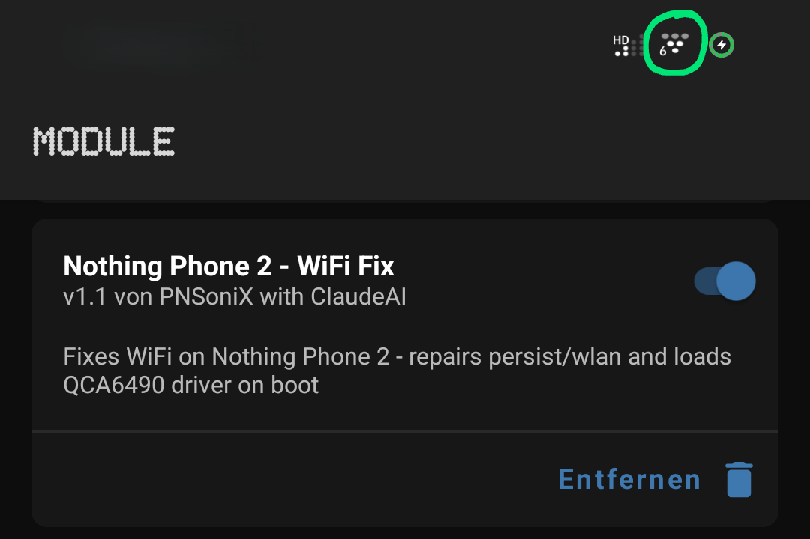

<div align="center">

# 📶 Nothing Phone 2 — WiFi Fix Magisk Module

[](https://github.com/topjohnwu/Magisk)
[](https://nothing.tech)
[](https://www.qualcomm.com)
[](LICENSE)

**Fixes broken WiFi on the Nothing Phone 2 (codename: Pong) caused by a corrupted or missing `persist/wlan` partition config — originally triggered by a Google WiFi Provisioner app update.**

---

<!-- Replace with your own screenshot -->


</div>

---

## 🐛 The Problem

After a Google WiFi Provisioner app update, WiFi stopped working entirely on some Nothing Phone 2 units. Uninstalling the app update did **not** fix the issue, and even flashing a custom ROM (e.g. Evolution X) left WiFi broken.

**Root cause:** The update corrupted or wiped the `/mnt/vendor/persist/wlan/` directory, which contains the configuration file needed to initialize the QCA6490 WiFi/BT chip. Without it, the kernel driver (`qca_cld3_qca6490.ko`) never loads and `wlan0` never appears.

Additionally, the `cnss2` platform driver does not automatically bind to the QCA6490 device node on affected units, requiring a manual trigger.

### Symptoms
- WiFi toggle is greyed out or does nothing
- `wlan0` interface does not exist
- Bluetooth may still work (same chip, different driver path)
- Problem persists across ROM flashes and factory resets

---

## ✅ The Fix

This Magisk module runs a boot script that:

1. **Repairs `persist/wlan`** — copies `WCNSS_qcom_cfg.ini` from the vendor partition if missing
2. **Binds the `cnss2` driver** — manually triggers the platform driver bind
3. **Loads the WiFi driver** — `insmod qca_cld3_qca6490.ko`
4. **Triggers `fs_ready`** — signals CNSS that the filesystem is ready for calibration
5. **Brings up `wlan0`** — waits and activates the interface

---

## 📋 Requirements

| Requirement | Details |
|---|---|
| Device | Nothing Phone 2 (Pong) |
| Root | Magisk or KernelSU |
| Android | Any ROM (tested on Nothing OS & Evolution X) |
| Architecture | ARM64 |

> ⚠️ **This module is specifically built for the Nothing Phone 2.** It will not work on other devices without modification (different CNSS device address, different driver name).

---

## 📦 Installation

### Option A — Flash ZIP via Magisk (recommended)

1. Download the latest ZIP from [Releases](../../releases)
2. Open **Magisk** → **Modules** → **Install from storage**
3. Select the ZIP file
4. Reboot
5. wait 60s
6. First Time you have to activate WiFi manually in Settings

### Option B — Manual install via Termux (no ZIP needed)

Open Termux and run as root (`su`):

```bash
rm -rf /data/adb/modules/nothing_phone2_wifi_fix
mkdir -p /data/adb/modules/nothing_phone2_wifi_fix
```

Create `module.prop`:
```bash
cat > /data/adb/modules/nothing_phone2_wifi_fix/module.prop << 'PROP'
id=nothing_phone2_wifi_fix
name=Nothing Phone 2 - WiFi Fix
version=v1.1
versionCode=2
author=PNSoniX with ClaudeAI
description=Fixes WiFi on Nothing Phone 2 - repairs persist/wlan and loads QCA6490 driver on boot
PROP
```

Create `service.sh`:
```bash
cat > /data/adb/modules/nothing_phone2_wifi_fix/service.sh << 'SH'
#!/system/bin/sh
LOGFILE=/data/adb/modules/nothing_phone2_wifi_fix/wifi_fix.log
echo "[$(date)] WiFi fix service started" > $LOGFILE

CNSS_DEVICE="b0000000.qcom,cnss-qca6490"
CNSS_PATH="/sys/bus/platform/drivers/cnss2"

# Warte bis das Device im Platform-Bus erscheint (max 60 Sekunden)
echo "[$(date)] Waiting for cnss2 device node..." >> $LOGFILE
for i in $(seq 1 30); do
    sleep 2
    if [ -e "$CNSS_PATH/$CNSS_DEVICE" ]; then
        echo "[$(date)] cnss2 device found after ${i}x2s" >> $LOGFILE
        break
    fi
    if [ $i -eq 30 ]; then
        echo "[$(date)] Timeout waiting for cnss2 device, trying manual bind..." >> $LOGFILE
    fi
done

if [ ! -f "/mnt/vendor/persist/wlan/WCNSS_qcom_cfg.ini" ]; then
    echo "[$(date)] Repairing persist/wlan..." >> $LOGFILE
    mkdir -p /mnt/vendor/persist/wlan
    cp /vendor/etc/wifi/qca6490/WCNSS_qcom_cfg.ini /mnt/vendor/persist/wlan/
    chown -R wifi:wifi /mnt/vendor/persist/wlan/
    chmod 644 /mnt/vendor/persist/wlan/WCNSS_qcom_cfg.ini
    chcon -R u:object_r:wifi_vendor_data_file:s0 /mnt/vendor/persist/wlan/
    echo "[$(date)] persist/wlan repaired" >> $LOGFILE
else
    echo "[$(date)] persist/wlan OK" >> $LOGFILE
fi

if [ ! -e "$CNSS_PATH/$CNSS_DEVICE" ]; then
    echo "[$(date)] Binding cnss2..." >> $LOGFILE
    echo "$CNSS_DEVICE" > "$CNSS_PATH/bind" 2>> $LOGFILE
    sleep 3
else
    echo "[$(date)] cnss2 already bound" >> $LOGFILE
fi

echo "[$(date)] Loading wlan driver..." >> $LOGFILE
insmod /vendor/lib/modules/qca_cld3_qca6490.ko 2>> $LOGFILE
sleep 3

echo "[$(date)] Triggering fs_ready..." >> $LOGFILE
setenforce 0
echo 1 > "/sys/devices/platform/soc/$CNSS_DEVICE/fs_ready" 2>> $LOGFILE
setenforce 1

for i in $(seq 1 15); do
    sleep 2
    if ip link show wlan0 > /dev/null 2>&1; then
        ip link set wlan0 up
        echo "[$(date)] wlan0 UP after ${i}x2s - SUCCESS!" >> $LOGFILE
        exit 0
    fi
done
echo "[$(date)] ERROR: wlan0 not found" >> $LOGFILE
```

Then reboot.

---

## 🔍 Verify it worked

After reboot, check the log (must bee root):

```bash
cat /data/adb/modules/nothing_phone2_wifi_fix/wifi_fix.log
```

A successful run looks like this:

```
[Tue Apr 28 04:10:00 CEST 2026] WiFi fix service started
[Tue Apr 28 04:10:15 CEST 2026] persist/wlan OK
[Tue Apr 28 04:10:15 CEST 2026] Binding cnss2...
[Tue Apr 28 04:10:18 CEST 2026] Loading wlan driver...
[Tue Apr 28 04:10:21 CEST 2026] Triggering fs_ready...
[Tue Apr 28 04:10:25 CEST 2026] wlan0 UP after 2x2s - SUCCESS!
```

---

## 🧠 Technical Background

The Nothing Phone 2 uses a **Qualcomm QCA6490** combo chip for WiFi 6 and Bluetooth 5.2, managed by the **CNSS2** (Connectivity Subsystem) platform driver.

The boot sequence normally looks like this:

```
cnss2 driver  →  binds to b0000000.qcom,cnss-qca6490
      ↓
fs_ready trigger  →  signals filesystem is available
      ↓
qca_cld3_qca6490.ko loads  →  wlan0 appears
      ↓
wpa_supplicant  →  WiFi works
```

After the Google WiFi Provisioner incident, `/mnt/vendor/persist/wlan/` was wiped. Without `WCNSS_qcom_cfg.ini`, the CNSS subsystem cannot initialize, `cnss2` never binds, and the entire chain breaks — **across any ROM**, because `persist` is a separate partition that survives flashing.

---

## 📁 Repository Structure

```
nothing-phone2-wifi-fix/
├── module.prop          # Magisk module metadata
├── service.sh           # Boot script (the actual fix)
├── META-INF/            # Flashable ZIP structure
│   └── com/google/android/
│       ├── update-binary
│       └── updater-script
└── README.md
```

---

## 🤝 Contributing

Found a bug or have an improvement? PRs are welcome!

---

## 📄 License

MIT License — see [LICENSE](LICENSE) for details.

---

<div align="center">

Discovered & fixed with ❤️ and a lot of `dmesg | grep` by a PNSoniX and Claude.

*WiFi is a human right.*

</div>
