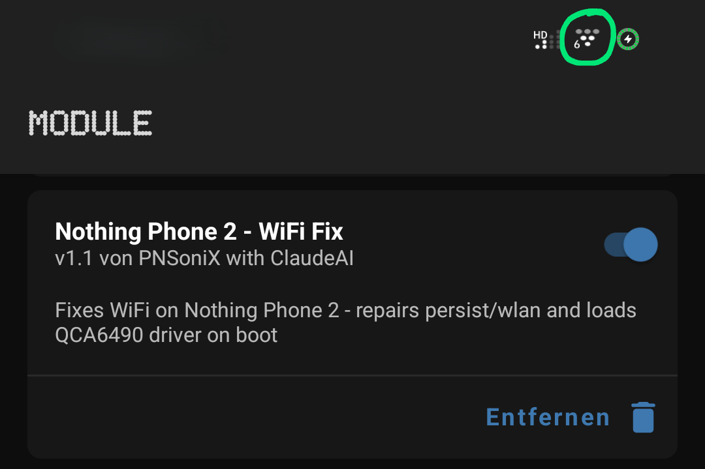

<div align="center">

# 📶 Nothing Phone 2 — WiFi Fix Magisk Module

[](https://github.com/topjohnwu/Magisk)
[](https://nothing.tech)
[](https://www.qualcomm.com)
[](LICENSE)

**Fixes broken WiFi on the Nothing Phone 2 (codename: Pong) caused by a corrupted or missing `persist/wlan` partition config — originally triggered by a Google WiFi Provisioner app update.**

---

<!-- Replace with your own screenshot -->


</div>

---

## 🐛 The Problem

After a Google WiFi Provisioner app update, WiFi stopped working entirely on some Nothing Phone 2 units. Uninstalling the app update did **not** fix the issue, and even flashing a custom ROM (e.g. Evolution X) left WiFi broken.

**Root cause:** The update corrupted or wiped the `/mnt/vendor/persist/wlan/` directory, which contains the configuration file needed to initialize the QCA6490 WiFi/BT chip. Without it, the kernel driver (`qca_cld3_qca6490.ko`) never loads and `wlan0` never appears.

Additionally, the `cnss2` platform driver does not automatically bind to the QCA6490 device node on affected units, requiring a manual trigger.

### Symptoms
- WiFi toggle is greyed out or does nothing
- `wlan0` interface does not exist
- Bluetooth may still work (same chip, different driver path)
- Problem persists across ROM flashes and factory resets

---

## ✅ The Fix

This Magisk module runs a boot script that:

1. **Repairs `persist/wlan`** — copies `WCNSS_qcom_cfg.ini` from the vendor partition if missing
2. **Binds the `cnss2` driver** — manually triggers the platform driver bind
3. **Loads the WiFi driver** — `insmod qca_cld3_qca6490.ko`
4. **Triggers `fs_ready`** — signals CNSS that the filesystem is ready for calibration
5. **Brings up `wlan0`** — waits and activates the interface

---

## 📋 Requirements

| Requirement | Details |
|---|---|
| Device | Nothing Phone 2 (Pong) |
| Root | Magisk or KernelSU |
| Android | Any ROM (tested on Nothing OS & Evolution X) |
| Architecture | ARM64 |

> ⚠️ **This module is specifically built for the Nothing Phone 2.** It will not work on other devices without modification (different CNSS device address, different driver name).

---

## 📦 Installation

### Option A — Flash ZIP via Magisk (recommended)

1. Download the latest ZIP from [Releases](../../releases)
2. Open **Magisk** → **Modules** → **Install from storage**
3. Select the ZIP file
4. Reboot (there can be Crashdumps after boot with Module, just wait)
5. wait 60s
6. First Time you have to activate WiFi manually in Settings

### Option B — Manual install via Termux (no ZIP needed)

Open Termux and run as root (`su`):

```bash
rm -rf /data/adb/modules/nothing_phone2_wifi_fix
mkdir -p /data/adb/modules/nothing_phone2_wifi_fix
```

Create `module.prop`:
```bash
cat > /data/adb/modules/nothing_phone2_wifi_fix/module.prop << 'PROP'
id=nothing_phone2_wifi_fix
name=Nothing Phone 2 - WiFi Fix
version=v1.2
versionCode=2
author=PNSoniX with ClaudeAI
description=Fixes WiFi on Nothing Phone 2 - repairs persist/wlan and loads QCA6490 driver on boot
PROP
```

Create `service.sh`:
```bash
cat > /data/adb/modules/nothing_phone2_wifi_fix/service.sh << 'SH'
#!/system/bin/sh

MODDIR=/data/adb/modules/nothing_phone2_wifi_fix
LOGFILE="$MODDIR/wifi_fix.log"

CNSS_DEVICE="b0000000.qcom,cnss-qca6490"
CNSS_DRIVER="/sys/bus/platform/drivers/cnss2"
CNSS_DEVICE_PATH="/sys/devices/platform/soc/$CNSS_DEVICE"
FS_READY="$CNSS_DEVICE_PATH/fs_ready"

PERSIST_DIR="/mnt/vendor/persist/wlan"
PERSIST_CFG="$PERSIST_DIR/WCNSS_qcom_cfg.ini"
VENDOR_CFG="/vendor/etc/wifi/qca6490/WCNSS_qcom_cfg.ini"

WLAN_MODULE="/vendor/lib/modules/qca_cld3_qca6490.ko"

log()
{
    echo "[$(date)] $*" >> "$LOGFILE"
}

echo "[$(date)] WiFi fix service started" > "$LOGFILE"


#
# Already working?
#
if ip link show wlan0 >/dev/null 2>&1; then
    log "wlan0 already exists - SUCCESS"
    exit 0
fi


#
# Wait for Android to finish early boot.
#
log "Waiting for Android boot completion..."

for i in $(seq 1 120); do
    BOOT_COMPLETED="$(getprop sys.boot_completed)"

    if [ "$BOOT_COMPLETED" = "1" ]; then
        log "Android boot completed after ${i}s"
        break
    fi

    sleep 1
done

if [ "$(getprop sys.boot_completed)" != "1" ]; then
    log "WARNING: sys.boot_completed never became 1"
fi


#
# Give PCI / Bluetooth / CNSS / power management some extra settling time.
#
log "Waiting 10 seconds for hardware initialization to settle..."
sleep 10


#
# Android might have fixed WiFi itself meanwhile.
#
if ip link show wlan0 >/dev/null 2>&1; then
    log "wlan0 appeared normally - SUCCESS"
    exit 0
fi


#
# Wait for persist.
#
log "Waiting for persist filesystem..."

for i in $(seq 1 30); do
    if [ -d /mnt/vendor/persist ]; then
        log "persist available"
        break
    fi

    sleep 1
done


#
# Repair persist/wlan if necessary.
#
if [ ! -f "$PERSIST_CFG" ]; then

    log "WCNSS_qcom_cfg.ini missing - repairing"

    mkdir -p "$PERSIST_DIR"

    if [ ! -f "$VENDOR_CFG" ]; then
        log "ERROR: vendor WiFi config missing"
        exit 1
    fi

    cp "$VENDOR_CFG" "$PERSIST_CFG"

    chown wifi:wifi "$PERSIST_DIR"
    chown wifi:wifi "$PERSIST_CFG"

    chmod 755 "$PERSIST_DIR"
    chmod 644 "$PERSIST_CFG"

    chcon u:object_r:wifi_vendor_data_file:s0 "$PERSIST_DIR" \
        2>> "$LOGFILE"

    chcon u:object_r:wifi_vendor_data_file:s0 "$PERSIST_CFG" \
        2>> "$LOGFILE"

    log "persist/wlan repaired"

else
    log "persist/wlan OK"
fi


#
# Wait for CNSS2.
#
log "Waiting for cnss2..."

for i in $(seq 1 60); do
    if [ -d "$CNSS_DRIVER" ]; then
        break
    fi

    sleep 1
done

if [ ! -d "$CNSS_DRIVER" ]; then
    log "ERROR: cnss2 unavailable"
    exit 1
fi


#
# Bind device if necessary.
#
if [ ! -e "$CNSS_DRIVER/$CNSS_DEVICE" ]; then

    log "Binding QCA6490 to cnss2..."

    echo "$CNSS_DEVICE" > "$CNSS_DRIVER/bind" 2>> "$LOGFILE"

    sleep 2

else
    log "QCA6490 already bound"
fi


#
# Wait for fs_ready.
#
for i in $(seq 1 30); do

    if [ -e "$FS_READY" ]; then
        break
    fi

    sleep 1

done

if [ ! -e "$FS_READY" ]; then
    log "ERROR: fs_ready unavailable"
    exit 1
fi


#
# Correct module detection.
#
if grep -q '^qca6490 ' /proc/modules; then
    log "qca6490 module already loaded"
else

    log "qca6490 module not loaded - loading it"

    insmod "$WLAN_MODULE" 2>> "$LOGFILE"

    sleep 2

fi


#
# Enable CNSS recovery rather than allowing WLAN crash to reboot/panic
# on kernels supporting this control.
#
if [ -e "$CNSS_DEVICE_PATH/recovery" ]; then
    log "Enabling CNSS recovery"
    echo 1 > "$CNSS_DEVICE_PATH/recovery" 2>> "$LOGFILE"
fi


#
# fs_ready retry loop.
#
# PCI resume sometimes returns -EAGAIN on this device.
#
for ATTEMPT in 1 2 3 4; do

    if ip link show wlan0 >/dev/null 2>&1; then

        ip link set wlan0 up 2>> "$LOGFILE"

        log "wlan0 UP before attempt $ATTEMPT - SUCCESS"
        exit 0

    fi


    log "Triggering fs_ready - attempt $ATTEMPT"

    SELINUX_STATE="$(getenforce 2>/dev/null)"

    setenforce 0 2>/dev/null

    echo 1 > "$FS_READY" 2>> "$LOGFILE"

    if [ "$SELINUX_STATE" = "Enforcing" ]; then
        setenforce 1 2>/dev/null
    fi


    #
    # Cold boot calibration is asynchronous.
    #
    # Don't hammer fs_ready repeatedly; give CNSS enough time to
    # finish or fail the PCI power-up attempt.
    #
    log "Waiting for wlan0 after attempt $ATTEMPT..."

    for i in $(seq 1 20); do

        sleep 1

        if ip link show wlan0 >/dev/null 2>&1; then

            ip link set wlan0 up 2>> "$LOGFILE"

            log "wlan0 UP on attempt $ATTEMPT after ${i}s - SUCCESS"
            exit 0

        fi

    done


    log "Attempt $ATTEMPT did not create wlan0"

    #
    # Wait before retrying PCI/cold boot calibration.
    #
    if [ "$ATTEMPT" -lt 4 ]; then
        log "Waiting 5 seconds before retry..."
        sleep 5
    fi

done


#
# Failure diagnostics.
#
log "ERROR: wlan0 still not found"

log "===== UPTIME ====="
cat /proc/uptime >> "$LOGFILE" 2>&1

log "===== BOOT STATE ====="
echo "sys.boot_completed=$(getprop sys.boot_completed)" >> "$LOGFILE"
echo "cnss-daemon=$(getprop init.svc.cnss-daemon)" >> "$LOGFILE"
echo "vendor.cnss_diag=$(getprop init.svc.vendor.cnss_diag)" >> "$LOGFILE"

log "===== MODULES ====="
grep -Ei 'qca|cnss|wlan|mhi' /proc/modules >> "$LOGFILE" 2>&1

log "===== NETWORK ====="
ip link >> "$LOGFILE" 2>&1

log "===== CNSS ====="
ls -la "$CNSS_DEVICE_PATH" >> "$LOGFILE" 2>&1

log "===== DMESG ====="
dmesg | grep -Ei \
    'cnss|qca|wlan|wlfw|mhi|pcie|pci link|calibration' \
    | tail -n 300 >> "$LOGFILE" 2>&1

exit 1
SH
```

Then reboot. (there can be Crashdumps after boot with Module, just wait)

---

## 🔍 Verify it worked

After reboot, check the log. Must be root (`su`):

```bash
cat /data/adb/modules/nothing_phone2_wifi_fix/wifi_fix.log
```

A successful run looks like this:

```
[Tue Apr 28 04:10:00 CEST 2026] WiFi fix service started
[Tue Apr 28 04:10:15 CEST 2026] persist/wlan OK
[Tue Apr 28 04:10:15 CEST 2026] Binding cnss2...
[Tue Apr 28 04:10:18 CEST 2026] Loading wlan driver...
[Tue Apr 28 04:10:21 CEST 2026] Triggering fs_ready...
[Tue Apr 28 04:10:25 CEST 2026] wlan0 UP after 2x2s - SUCCESS!
```

---

## 🧠 Technical Background

The Nothing Phone 2 uses a **Qualcomm QCA6490** combo chip for WiFi 6 and Bluetooth 5.2, managed by the **CNSS2** (Connectivity Subsystem) platform driver.

The boot sequence normally looks like this:

```
cnss2 driver  →  binds to b0000000.qcom,cnss-qca6490
      ↓
fs_ready trigger  →  signals filesystem is available
      ↓
qca_cld3_qca6490.ko loads  →  wlan0 appears
      ↓
wpa_supplicant  →  WiFi works
```

After the Google WiFi Provisioner incident, `/mnt/vendor/persist/wlan/` was wiped. Without `WCNSS_qcom_cfg.ini`, the CNSS subsystem cannot initialize, `cnss2` never binds, and the entire chain breaks — **across any ROM**, because `persist` is a separate partition that survives flashing.

---

## 📁 Repository Structure

```
nothing-phone2-wifi-fix/
├── module.prop          # Magisk module metadata
├── service.sh           # Boot script (the actual fix)
├── META-INF/            # Flashable ZIP structure
│   └── com/google/android/
│       ├── update-binary
│       └── updater-script
└── README.md
```

---

## 🤝 Contributing

Found a bug or have an improvement? PRs are welcome!

---

## 📄 License

MIT License — see [LICENSE](LICENSE) for details.

---

<div align="center">

Discovered & fixed with ❤️ and a lot of `dmesg | grep` by PNSoniX and Claude.

*WiFi is a human right.*

</div>
